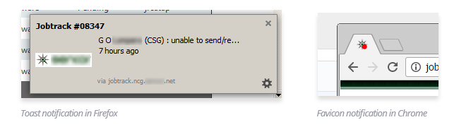

# netops-fix

Just a missing piece for our netops sites that it could work well with modern day browsers. This extension will basically extend a few features that would help optimize our work.

## Features

- shows notification for every new jobtrack or an unassigned overdue jobtrack
- auto reload site when site crashes (yup, our site randomly crashes, well, fret not)
- An easy access to turnover through browser action
- added direct copy to clipboard on relevant information
- design fixes
- menu through browser action
- added basic lightbox support on select images.
- Firefox: added sidebar for routine (for quick tab)

## BUG
- Chrome: jquery doesn't load on jobtrack homepage (but works in resolverdb page), this affects datatables

## TO-DO
- check if feasible if we could send push notifications to android using native messaging and firebase. this would allow moving data from intranet and send it to phones through a browser.

This works with Chrome and Firefox.